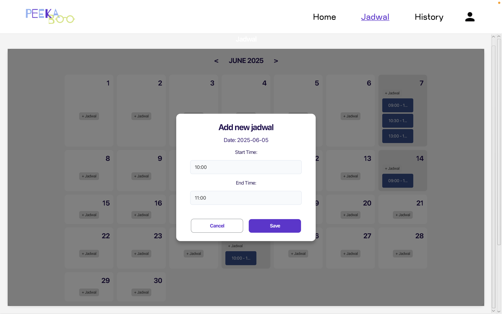
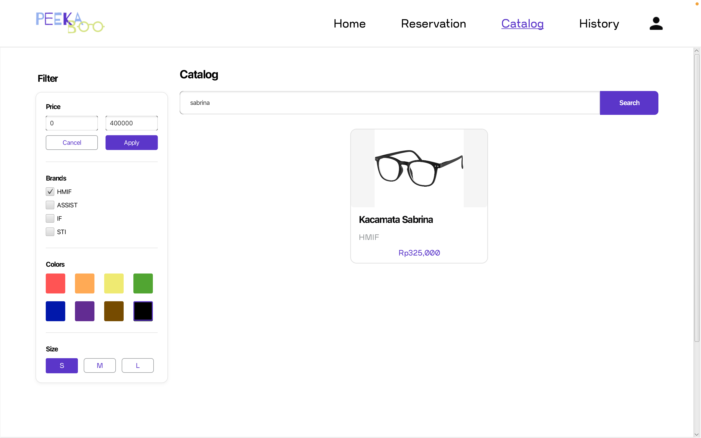

# RPL-Optik-Peekaboo

## Table of Contents
## 📚 Table of Contents
- 📖 [Deskripsi Perangkat Lunak](#deskripsi-perangkat-lunak)
- 🛠️ [How To Install & Run Program](#how-to-install--run-program)
- 🎯 [Modul Implementation](#modul-implementation)
- 👩‍💻 [Pembagian Tugas](#pembagian-tugas)
- 🗄️ [Database Information](#database-information)

---

## 📖 Deskripsi Perangkat Lunak

**Peekaboo** merupakan perangkat lunak sistem manajemen produk optik yang dirancang khusus untuk meningkatkan efisiensi operasional di Peekaboo. Perangkat lunak ini mencakup fitur reservasi pemeriksaan mata, pencatatan dan integritas resep, pemesanan produk, transaksi pembayaran, pelacakan status pesanan, serta manajemen stok secara real-time. Dengan Peekaboo, pelanggan dapat dengan mudah menjadwalkan pemeriksaan mata secara online, memilih kacamata sesuai resep, dan melakukan pembayaran melalui berbagai metode, sementara admin dapat memantau stok dan laporan transaksi dengan lebih akurat dan efisien.

---


## 🛠️ How To Install & Run Program

### ➝ Persiapan Aplikasi
1. Install JDK minimal versi 11  
2. Install Maven  
3. Clone repository  
4. Pindah ke direktori `RPL-Optik-Peekaboo/demo`  
5. Buka folder tersebut menggunakan IDE seperti IntelliJ IDEA atau VS Code
6. ubah directory ke src 
   ```bash
    cd src
7. Buka terminal, lalu jalankan perintah:  
   ```bash
   mvn clean javafx:run

### ➝ Persiapan Database
1. Download File SQL Database
2. Masuk ke PostgreSQL dan Buat Database Baru
   ```bash
    psql -U postgres
    CREATE DATABASE optikpeekaboo;
    \q

3. Import File SQL ke Database
    
    Jalankan perintah:
   ```bash
    psql -U postgres -d optikpeekaboo -f path/to/
4. Ubah Konfigurasi Credential Database

Buka file:
   ```bash
    util/DatabaseConnector.java
  ```

---

## 🎯 Modul Implementation
### **Modul 1** : Sign Up / Sign In 


### **Modul 2** : Home / Beranda 
 

### **Modul 3** : Tampilan Ketersediaan Jadwal 
#### ➝ Tampilan Jadwal Optometris
 


#### ➝ Tampilan Jadwal Pelanggan

### **Modul 4** : Tampilan Halaman Reservasi  


### **Modul 5** : Tampilan Mereservasi  
#### ➝ Tampilan Jadwal Optometris


#### ➝ Tampilan Jadwal Pelanggan


### **Modul 6** : Tampilan Katalog Produk  



### **Modul 7** : Tampilan Membeli Produk  


### **Modul 8** : Tampilan Melihat Data Pribadi  


### **Modul 9** : Tampilan Melihat Resep


## 👩‍💻 Pembagian Tugas
<table>
  <tr>
    <td align="center">
      <a href="https://github.com/sharondarmap">
        <br/>
        <strong>Sharon Darma Putra</strong><br/>
        18223107
      </a>
    </td>
    <td align="center">
      <a href="https://github.com/desatidinda">
        <br/>
        <strong>Desati Dinda S</strong><br/>
        18223110
      </a>
    </td>
    <td align="center">
      <a href="https://github.com/snachkzs">
        <br/>
        <strong>Alma Felicia V</strong><br/>
        18223112
      </a>
    </td>
    <td align="center">
      <a href="https://github.com/NakeishaValya">
        <br/>
        <strong>Nakeisha V. Shakila</strong><br/>
        18223133
      </a>
    </td>
    <td align="center">
      <a href="https://github.com/lidyamarth">
        <br/>
        <strong>Lidya Marthadilla</strong><br/>
        18223134
      </a>
    </td>
  </tr>
</table>

---

| Nama Lengkap              | NIM       | Tugas                                                                 |
|---------------------------|-----------|------------------------------------------------------------------------|
| Sharon Darma Putra        | 18223107  | <ul><li>Auth</li><li>Penjadwalan</li><li>Backend</li></ul>            |
| Desati Dinda S            | 18223110  | <ul><li>Reservasi</li><li>Penjadwalan</li><li>Entity Reservasi</li></ul> |
| Alma Felicia V            | 18223112  | <ul><li>Katalog Produk</li><li>Filtering</li><li>Barang (entity & logic katalog)</li></ul> |
| Nakeisha V. Shakila       | 18223133  | <ul><li>Pembelian</li><li>Checkout</li><li>Entity untuk Pembelian</li></ul> |
| Lidya Marthadilla         | 18223134  | <ul><li>Katalog Produk</li><li>Filtering</li><li>Barang (entity & logic katalog)</li></ul> |


---

## 🗄️ Database Information

### ➝ Tabel dan Atribut

[Tabel 1: jadwal](#tabel-1-jadwal)  
[Tabel 2: laporankeuangan](#tabel-2-laporankeuangan)  
[Tabel 3: pesanan](#tabel-3-pesanan)  
[Tabel 4: produk](#tabel-4-produk)  
[Tabel 5: resep](#tabel-5-resep)  
[Tabel 6: reservasi](#tabel-6-reservasi)  
[Tabel 7: statuspesanan](#tabel-7-statuspesanan)  
[Tabel 8: users](#tabel-8-users)

---

#### Tabel 1: jadwal

Tabel ini berisi data jadwal pemeriksaan optometris.

| Atribut       | Tipe Data                | Keterangan                                     |
|---------------|--------------------------|------------------------------------------------|
| idjadwal      | integer                  | Primary Key                                    |
| statusjadwal  | status_jadwal_enum       | ENUM('AVAILABLE', 'RESERVED')                  |
| idoptometris  | integer                  | Foreign Key ke `users(iduser)`                 |
| tanggal       | date                     | Tanggal pemeriksaan                            |
| jam_mulai     | time without time zone   | Waktu mulai pemeriksaan                        |
| jam_selesai   | time without time zone   | Waktu selesai pemeriksaan                      |

---

#### Tabel 2: laporankeuangan

Tabel ini berisi laporan keuangan harian.

| Atribut         | Tipe Data | Keterangan                     |
|-----------------|-----------|--------------------------------|
| idlaporan       | integer   | Primary Key                    |
| tanggalpesanan  | date      | Tanggal data pesanan dihitung  |
| totalpendapatan | integer   | Total pendapatan harian        |
| lababersih      | integer   | Laba bersih harian             |

---

#### Tabel 3: pesanan

Tabel ini menyimpan data pesanan produk dari pelanggan.

| Atribut        | Tipe Data | Keterangan                               |
|----------------|-----------|------------------------------------------|
| idpesanan      | integer   | Primary Key                              |
| total          | integer   | Total harga pesanan                      |
| tanggalpesanan | date      | Tanggal pesanan dilakukan                |
| alamat         | text      | Alamat pengiriman                        |
| idpelanggan    | integer   | Foreign Key ke `users(iduser)`           |
| idproduk       | integer   | Foreign Key ke `produk(idproduk)`        |

---

#### Tabel 4: produk

Tabel ini menyimpan data produk yang tersedia di toko.

| Atribut     | Tipe Data               | Keterangan         |
|-------------|-------------------------|--------------------|
| idproduk    | integer                 | Primary Key        |
| namaproduk  | character varying(100)  | Nama produk        |
| brand       | character varying(50)   | Merek produk       |
| harga       | integer                 | Harga produk       |
| stok        | integer                 | Stok produk        |
| warna       | character varying(20)   | Warna produk       |
| ukuran      | character varying(10)   | Ukuran produk      |

---

#### Tabel 5: resep

Tabel ini berisi data resep optik milik pelanggan.

| Atribut      | Tipe Data        | Keterangan                          |
|--------------|------------------|-------------------------------------|
| idresep      | integer          | Primary Key                         |
| pluskanan    | double precision | Nilai plus mata kanan               |
| pluskiri     | double precision | Nilai plus mata kiri                |
| minuskanan   | double precision | Nilai minus mata kanan              |
| minuskiri    | double precision | Nilai minus mata kiri               |
| cylkanan     | double precision | Nilai silinder mata kanan           |
| cylkiri      | double precision | Nilai silinder mata kiri            |
| axiskanan    | double precision | Nilai axis mata kanan               |
| axiskiri     | double precision | Nilai axis mata kiri                |
| pd           | double precision | Jarak pupil                         |
| idpelanggan  | integer          | Foreign Key ke `users(iduser)`      |
| idoptometris | integer          | Foreign Key ke `users(iduser)`      |
| idjadwal     | integer          | Foreign Key ke `jadwal(idjadwal)`   |

---

#### Tabel 6: reservasi

Tabel ini menyimpan data reservasi pelanggan ke optometris.

| Atribut          | Tipe Data                  | Keterangan                                   |
|------------------|----------------------------|----------------------------------------------|
| idreservasi      | integer                    | Primary Key                                  |
| statusreservasi  | status_reservasi_enum      | ENUM('CONFIRMED', 'CANCELLED')               |
| idoptometris     | integer                    | Foreign Key ke `users(iduser)`               |
| idpelanggan      | integer                    | Foreign Key ke `users(iduser)`               |
| idjadwal         | integer                    | Foreign Key ke `jadwal(idjadwal)`            |
| tanggalreservasi | timestamp without time zone| Default CURRENT_TIMESTAMP                    |

---

#### Tabel 7: statuspesanan

Tabel ini menyimpan status terkini dari setiap pesanan.

| Atribut       | Tipe Data             | Keterangan                                       |
|---------------|-----------------------|--------------------------------------------------|
| idpesanan     | integer               | Primary Key, Foreign Key ke `pesanan(idpesanan)`|
| idstatus      | integer               | Primary Key                                      |
| statussaatini | character varying(30) | Status pesanan terkini                           |

---

#### Tabel 8: users

Tabel ini menyimpan informasi pengguna sistem, baik pelanggan maupun optometris.

| Atribut        | Tipe Data               | Keterangan            |
|----------------|-------------------------|-----------------------|
| iduser         | integer                 | Primary Key           |
| username       | character varying(50)   | Not Null              |
| password       | character varying(100)  | Not Null              |
| email          | character varying(100)  | Email pengguna        |
| no_telepon     | character varying(20)   | Nomor telepon         |
| tanggal_lahir  | date                    | Tanggal lahir         |
| jenis_kelamin  | character varying(10)   | Jenis kelamin         |
| alamat         | text                    | Alamat pengguna       |
| user_status    | character varying(20)   | Not Null              |

---

#### Tipe ENUM Khusus

- `status_jadwal_enum`: `'AVAILABLE'`, `'RESERVED'`  
- `status_reservasi_enum`: `'CONFIRMED'`, `'CANCELLED'`

---

### ➝ Hubungan Antar Tabel

Berikut adalah relasi antar tabel dalam basis data:

- **jadwal**  
  ↳ `users` melalui `idoptometris`  
  ↳ direferensikan oleh `resep` dan `reservasi`

- **laporankeuangan**  
  ↳ tidak memiliki foreign key

- **pesanan**  
  ↳ `users` (`idpelanggan`)  
  ↳ `produk` (`idproduk`)  
  ↳ direferensikan oleh `statuspesanan`

- **resep**  
  ↳ `users` (`idpelanggan`, `idoptometris`)  
  ↳ `jadwal`

- **reservasi**  
  ↳ `users` (`idpelanggan`, `idoptometris`)  
  ↳ `jadwal`

- **statuspesanan**  
  ↳ `pesanan`

- **users**  
  ↳ menjadi entitas referensi utama di banyak tabel